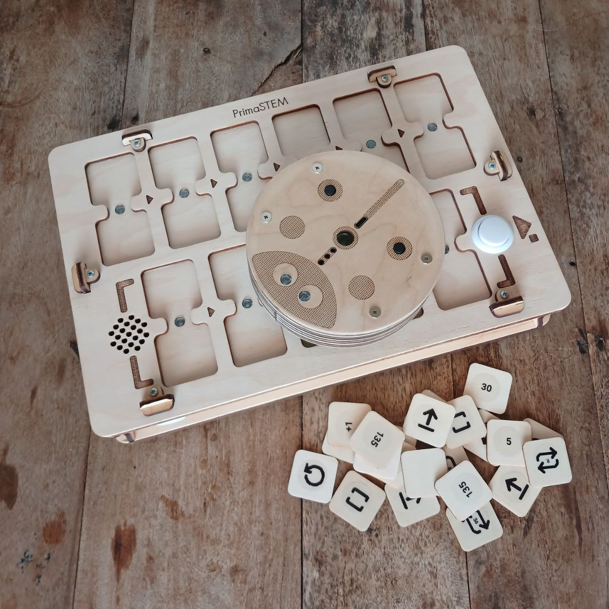
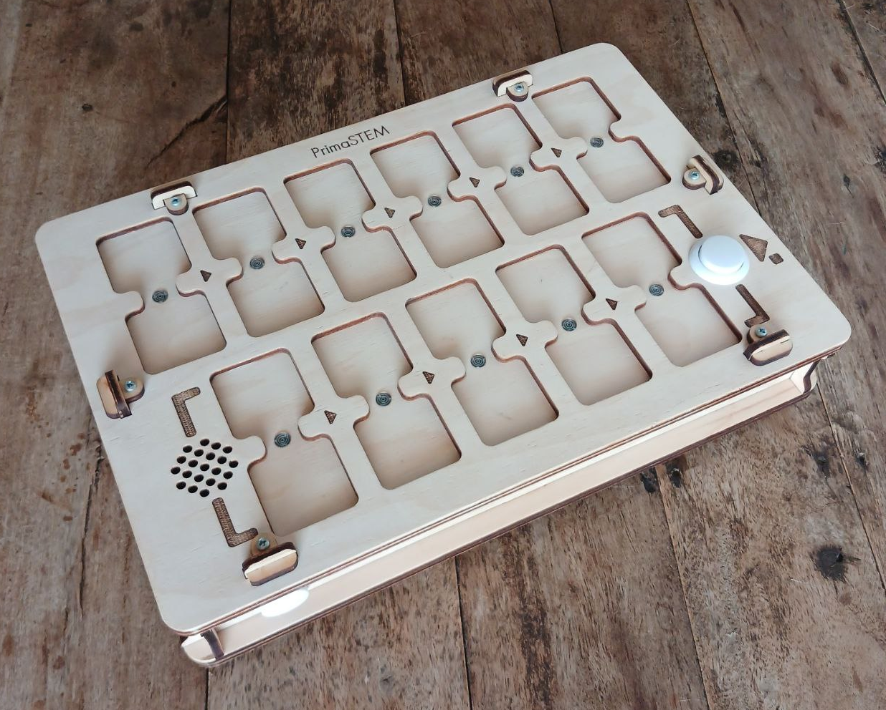

# User Manual

**PrimaSTEM** - a set for teaching children aged 4 to 12 the basics of logic, programming, and mathematics.

## Technical Specifications and Package Contents

- Game robot
- Robot control controller
- Chips for commands, values, and arithmetic operations to create programs
- Play field (depending on package)

> Package contents and appearance may slightly differ. Check details at purchase.

### Game Robot

Dimensions: D=125 mm, H=45 mm.

The robot has a power button, LEDs, a speaker, a function button, and a USB-C port for charging the battery.

A marker up to 10 mm in diameter can be placed in the robot's center for drawing simple figures while moving.

Appearance may slightly vary depending on the set, but the main functionality remains.

### Controller

Dimensions: L=310 mm, W=210 mm, H=52 mm.

The controller features 11 dual slots for installing command and value chips: 6 for the main program (top row), 5 for the subroutine (bottom row).  
The controller has two buttons: on the left-power, on the right-“Execute / Stop” to start and stop the program.

After installing command and value chips into the slots, press “Execute”: the robot will run the program. Active commands are indicated by LEDs between the slots.

If a chip is installed incorrectly-the controller indicates this with a red LED, but the program continues (for example, when a value chip is set without a command).

The controller has a USB-C charging port and a speaker.

### Chips – Instructions

Dimensions: LxW (or D)=30 mm.

The set includes chips for program creation.  
Each chip is a command with a clear value and instruction. The sequence of blocks determines the robot's behavior.

Chips are divided into **commands**, **values**, and **arithmetic**.

#### Command Chips

The main blocks for programming:

- **Forward** - move forward (10 cm by default)
- **Right** - turn 90° clockwise
- **Left** - turn 90° counter-clockwise
- **Back** - move backward (10 cm by default)
- **Function** - runs a subprogram from the controller's bottom row
- **Random Move** - one of the movement actions: Forward, Left, or Right (for the standard distance)

> There are also repeat (cycle) chips, number values, and arithmetic symbols for advanced programming-for example, command repetition and distance/angle modification.

#### Repeat (Cycle) Chips

Chips with numbers from 2 to 6 (as dots) and pictograms showing the repeat count.

A chip with a die means a random number of repeats from 1 to 6.

#### Value Chips

Angle and distance chips: 30°, 36°, 45°, and multiples (60°, 72°, etc.).  
Angles are in degrees, distances in millimeters.  
Defaults are 90° and 100 mm (10 cm).

#### Arithmetic Chips

Change parameters for movement commands:

- Addition (+)
- Subtraction (−)
- Multiplication (*)
- Division (/)
- Root (√)
- Power (^)

## Connecting the Controller and Robot

It is recommended to turn on the robot first, then the controller.

Place the robot on a flat surface before connecting: after pairing, the LEDs turn white. If not connected, they flash red.

Test the connection: insert a “Forward” chip and press “Execute”.

If there is no connection-restart both devices or charge them. Temporary connection loss is possible near strong electromagnetic sources (mobile phone, WiFi router).

> **After device firmware updates**, pairing may be required: turn on the robot, then the controller, press and hold the “Execute” button on the controller for 10–15 seconds, until you hear a sound.

## How Does It Work?

To program movement, install command chips (e.g., “Forward”, “Left”, “Function”) into the controller's slots.  
You can set command values and repeat counts, as well as angles, distances, or arithmetic operations.

To assign both a command and a value (repeat), slots are paired (“bridged”) with indicators.

  *Below is a sample program using a cycle to repeat a code section. The program creates a square path for the robot:*

Commands are placed in the upper part of the controller (6 slots) and run left to right. Empty slots or errors (e.g., two commands in one slot or a value without a command) are ignored.

The block sequence determines the robot's movement.

Press “Execute” to run the program.

Default settings:  
- “Forward” - 10 cm.
- “Left/Right” - 90°.
- Cycles repeat commands multiple times.
- “Function” calls the subprogram from the bottom row (5 slots).
- You can call a subprogram several times by adding a repeat chip to the “Function” (see the sample above).

**Key Features:**

- **Interrupt** the program by pressing “Execute” again during movement.
- The controller remembers the **last set value** (distance/angle) for a movement command until powered off: for example, if “Forward” = 200, all subsequent “Forward” commands use this value.
    - Handy for play fields with steps other than 10 cm.
    - Values from arithmetic operations are also saved.
- Change the **default step** using a special chip: e.g., for 12.5 cm, set the “Default Step” chip with value 125. Value is saved after power-off.
- **After firmware update** you may need to calibrate the gyroscope and drive distance:
    - a. For gyroscope calibration, place the robot on a level surface, insert the “Calibrate” chip in the controller, and press “Execute”.
    - b. **For distance calibration**, measure actual movement with the “Forward” command, set the “Calibrate” chip and the required value chip, then press “Execute”. You can record the value to any numeric NFC chip using an NFC-enabled phone as text “nXXX” (e.g., n095 for 95 mm). After this, the robot's movement distance will be accurate.
- The controller and robot **automatically power off** after 10 minutes of inactivity.
- If the robot is unused for 1–3 minutes, it makes small movements, indicating that it is working and ready.
- You can modify or **create your own chips**-commands, numbers, or arithmetic-with an NFC phone and any NFC tag writing app, like “NFC Tools”. Record a 4-character text (e.g., n100 for 100 mm) to a blank NFC chip. Contact us for instructions.

PrimaSTEM is a practical tool for learning programming, developing creative thinking and logic.

See the **Teacher’s Guide** for more details on features.

## Important!

> The set **is not intended for children under 4 years old** and contains small details - **choking hazard**! Use **only under adult supervision**!

The device contains Li-ion batteries. **Charge only under adult supervision** with a standard 5V USB adapter and USB-C cable.

A 1-hour charge of the controller and robot is enough for 1–2 lessons; a full charge (2–3 hours) lasts for 3 sessions of 30–45 minutes. Battery capacity may decline over time; 16340 Li-ion batteries can be replaced.

If unused for extended periods, charge the batteries **every 3–4 months**. Deep discharge may render them unusable and require replacement.

**Do not open the device** yourself-for repairs or battery replacement, contact the seller.

Store and use the set in a dry room at +10...+30°C, humidity 45–60%. Avoid direct sunlight, moisture, and dust.

Avoid impacts and vibration. Transport and store the device in original packaging at +5...+40°C, protected from damage and moisture.
