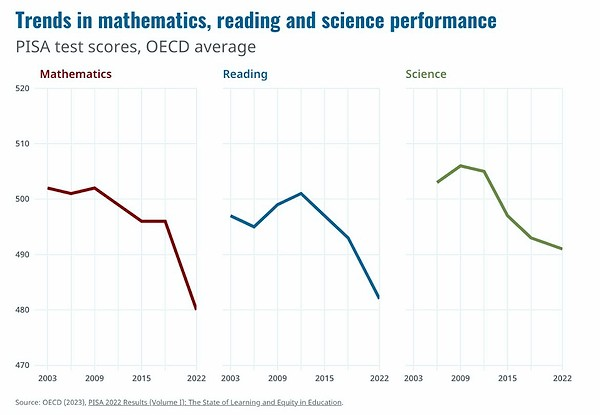
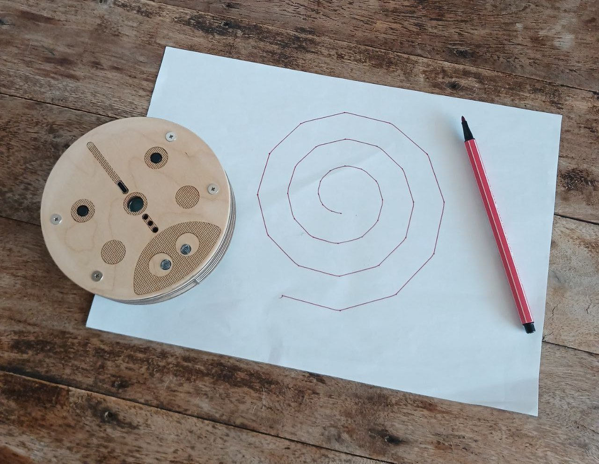

# Introduction

**PrimaSTEM** - un outil pour enseigner aux enfants dès 4 ans les bases de la programmation, de la logique et des mathématiques sans appareils à écran.

*Télécommande, blocs de programmation, robot et résultats d'exécution du code.*

## Pertinence

**Les enfants d'aujourd'hui** manifestent très tôt un intérêt pour les jeux vidéo et les appareils électroniques, qu'ils maîtrisent rapidement.

Les parents comprennent l'importance des technologies de l'information pour le développement réussi de leur enfant, tout en cherchant à maintenir un équilibre entre apprentissage et santé.

Les études montrent qu'une interaction précoce et fréquente avec les écrans peut réduire les capacités cognitives et les performances scolaires.

*Source : Programme international pour le suivi des acquis des élèves (PISA), [2022 Results (Volume I)](https://www.oecd-ilibrary.org/education/pisa-2022-results-volume-i_53f23881-en)*

L'utilisation d'appareils à écran par les jeunes enfants entraîne souvent :
- des difficultés psychologiques,
- une dépendance aux jeux,
- une détérioration de la vue et de la santé physique.

## Objectifs

Cet **outil** ludique aide les enfants dès 4 ans à apprendre la programmation, la logique et les mathématiques **sans écrans**.

PrimaSTEM permet d'acquérir :
- les nombres,
- l'orientation spatiale,
- les algorithmes,
- la pensée logique,
- les bases de la programmation,
- les opérations arithmétiques et progressions,
- les concepts géométriques.

**Avantages :**
- application universelle,
- format intéressant et visuel,
- apprentissage sans écrans,
- adapté aux enfants d'âge préscolaire et primaire,
- matériaux naturels.

> 🎯 **L'objectif principal** - développer les compétences cognitives grâce à une compréhension tangible et visuelle des principes de programmation et du résultat d'exécution des programmes.

## Comment ça marche ?

1. Allumez le robot et la télécommande.
2. Créez un programme en plaçant les jetons-commandes dans les emplacements de la télécommande.
3. Appuyez sur le bouton « Exécuter ».
4. Le robot exécutera le programme.

---

**Présentation vidéo :** [youtu.be/Ztq_I1WBiVo](https://youtu.be/Ztq_I1WBiVo)
<iframe width="560" height="315" src="https://www.youtube.com/embed/Ztq_I1WBiVo?si=a54tevy8tUEQMOva" title="YouTube video player" frameborder="0" allow="accelerometer; autoplay; clipboard-write; encrypted-media; gyroscope; picture-in-picture; web-share" referrerpolicy="strict-origin-when-cross-origin" allowfullscreen></iframe>
---

**Dessin mathématique utilisant une variable et des nombres négatifs :** [youtu.be/6Zoyku27mO8](https://youtu.be/6Zoyku27mO8)
<iframe width="560" height="315"  src="https://www.youtube.com/embed/6Zoyku27mO8?si=WYYMKyV7d768DI-D" title="YouTube video player" frameborder="0" allow="accelerometer; autoplay; clipboard-write; encrypted-media; gyroscope; picture-in-picture; web-share" referrerpolicy="strict-origin-when-cross-origin" allowfullscreen></iframe>
---

**Dessin mathématique d'un cœur :** [youtu.be/VgiWu200EGw](https://youtu.be/VgiWu200EGw)
<iframe  width="560" height="315" src="https://www.youtube.com/embed/VgiWu200EGw?si=EiQKbP0egmZ2aXCa" title="YouTube video player" frameborder="0" allow="accelerometer; autoplay; clipboard-write; encrypted-media; gyroscope; picture-in-picture; web-share" referrerpolicy="strict-origin-when-cross-origin" allowfullscreen></iframe>
---

> 📺  En savoir plus sur la chaîne [YouTube PrimaSTEM](https://www.youtube.com/@primastem)

## À qui est-ce destiné ?

PrimaSTEM est conçu pour les enfants et ressemble à un jeu, mais c'est un outil flexible pour les enseignants et les parents. Il peut être utilisé pour enseigner diverses matières - mathématiques, programmation, physique, histoire, géographie. Tout est limité uniquement par l'imagination et les compétences de l'enseignant ou des parents.

L'enfant acquiert des bases mathématiques et algorithmiques, ce qui constitue une excellente préparation pour l'école et la première expérience avec les langages de programmation (Scratch, Logo ou Minecraft).

*Exemple de résultat : spirale dessinée en modifiant dynamiquement une variable dans une boucle.*
