# Guide de l'Enseignant

Ce guide décrit les fonctionnalités du kit PrimaSTEM nécessaires pour créer des leçons et l'intégrer dans le processus éducatif.

PrimaSTEM est un jouet éducatif pour les enfants de 4 à 12 ans qui les aide à apprendre à programmer un robot amical sans ordinateurs, tablettes ou téléphones. Il développe la logique, les compétences en programmation et les mathématiques.

Les leçons avec PrimaSTEM rendent la programmation simple et visuelle pour les enfants. Même les très jeunes apprenants trouvent le processus clair et tactile - les bases de la programmation, de la logique et des mathématiques sont apprises sous forme ludique.

Jouer avec PrimaSTEM favorise le développement de compétences clés : pensée logique, algorithmes, programmation, mathématiques, géométrie, ainsi que le développement créatif et socio-émotionnel... Le kit PrimaSTEM est une étape préparatoire à la familiarisation avec les langages de programmation par blocs tels que [Scratch](https://en.wikipedia.org/wiki/Scratch_(programming_language)) ou [LOGO](https://en.wikipedia.org/wiki/Logo_(programming_language)).

## Découverte du Kit Éducatif

### Où Peut-on Utiliser PrimaSTEM ?

Applications efficaces dans les programmes éducatifs suivants :

- Centres d'éducation de la petite enfance
- Jardins d'enfants Montessori
- Écoles primaires
- Enseignement à domicile
- Centres de développement spéciaux
- Groupes périscolaires
- Clubs d'initiation à la programmation
- Camps éducatifs pour enfants

### Que Devez-vous Savoir pour Commencer ?

Avant d'utiliser le kit, nous recommandons aux enseignants et aux parents de lire le [manuel d'utilisation](user_manual.md) et ce guide. Aucune compétence spéciale en programmation n'est requise - les documents fournissent les bases nécessaires à l'enseignement.

## Recherche et Valeur du Kit
... PrimaSTEM s'inspire du langage de programmation [LOGO](https://en.wikipedia.org/wiki/Logo_(programming_language)), créé par [Seymour Papert](https://en.wikipedia.org/wiki/Seymour_Papert), et de la pédagogie Montessori. LOGO et le robot tortue ont rendu la programmation visuelle et accessible aux enfants.

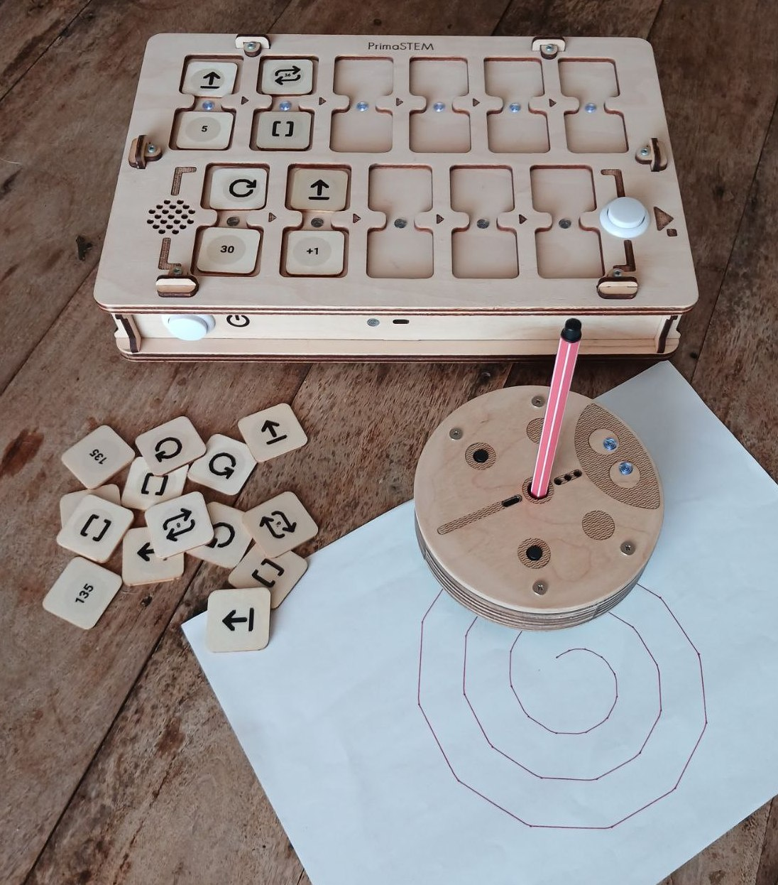

Les puces de commande PrimaSTEM mettent en œuvre cette approche. L'apprentissage devient intuitif grâce à un contrôle tactile simple, ne nécessitant ni écrans ni texte.

En observant le robot, les enfants apprennent la signification de chaque commande en pratiquant des algorithmes en temps réel.

Le robot possède une caractéristique importante : il a une direction, ce qui permet à l'enfant de s'identifier à lui et de comprendre plus facilement la logique fondamentale du fonctionnement des programmes.
... Toutes les commandes sont simples et claires : elles indiquent exactement dans quelle direction le robot doit se déplacer. Apprendre au robot à "agir" ou à "penser" encourage les enfants à réfléchir à leurs propres actions et pensées, rendant le processus d'apprentissage de la programmation plus efficace.

Les puces PrimaSTEM sont une représentation visuelle et simplifiée des langages de programmation. Au début de l'apprentissage, il n'y a ni texte ni nombres - seulement des commandes de base.

### Pourquoi le Bois ?

Le contrôleur et le robot sont fabriqués en bois. La pratique a montré que les enfants préfèrent jouer avec des jouets en bois - ils sont sûrs, durables et créent un sentiment d'histoire personnelle à l'usage.

## Concepts de Programmation avec PrimaSTEM

Les puces physiques de PrimaSTEM sont analogues aux instructions dans les langages de programmation réels, démontrant des concepts importants.

### Algorithmes

Les **algorithmes** sont des séquences de commandes précises (puces) qui composent un programme.

### File d'attente
... Les commandes sur le contrôleur PrimaSTEM sont exécutées strictement de gauche à droite, démontrant visuellement l'ordre d'exécution.

### Débogage (Correction d'Erreurs)

Les erreurs sont faciles à corriger : il suffit de remplacer une puce. Cette approche développe des compétences de débogage autonomes.

### Fonction

Une fonction (sous-programme) est un ensemble de commandes dans la partie inférieure du contrôleur, appelée depuis le programme principal à l'aide de la puce "**Fonction**".

## Application dans d'Autres Matières

PrimaSTEM aide également à développer d'autres compétences :

- **Communication** : Le jeu en groupe favorise la collaboration.
- **Habiletés motrices** : Travailler avec les puces améliore la coordination.
- **Compétences sociales** : Les enfants gagnent en confiance et apprennent le travail d'équipe.
- **Mathématiques** : Les concepts mathématiques de base sont maîtrisés.
- **Logique** : Les enfants apprennent à construire des séquences et à prédire les résultats.
... > En arrangeant les puces, l'enfant explore la programmation de manière tactile, visuelle et intellectuelle. Après avoir appuyé sur le bouton "Exécuter", le robot se déplace, et le résultat est comparé à l'attente de l'enfant. Cette expérience complète accélère l'apprentissage.

## Découverte du Robot et du Contrôleur

### Robot

Dites aux enfants que le robot est leur ami, qu'ils peuvent programmer. Expliquez : il n'a pas de pensées propres et n'exécute que leurs instructions - comme les appareils ménagers qui nécessitent d'être allumés.

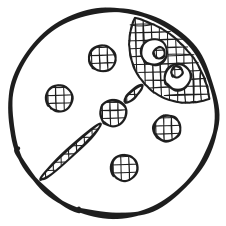

### Contrôleur

Expliquez que le contrôleur envoie des commandes au robot. Montrez comment insérer des puces de commande et programmer le robot.

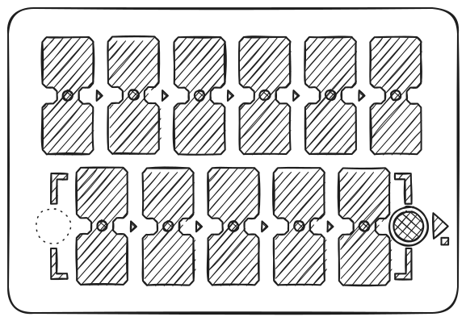

> Le programme principal est construit dans la rangée supérieure du contrôleur (6 emplacements). La rangée inférieure (5 emplacements) est destinée au sous-programme/fonction et utilisée avec la commande "**Fonction**".

### Puces de Commande
... Les puces sont des commandes pour le robot qui sont insérées dans le contrôleur. Après avoir appuyé sur "Exécuter", le robot effectue la séquence. Chaque puce est une commande distincte, qui enseigne la pensée informatique et la conception de programme. Il est important que les enfants comprennent ce que fait le robot lorsque chaque commande est activée - cela leur apprend à planifier des programmes et à prédire les actions du robot. Dites aux enfants : les puces ne doivent pas être perdues ou endommagées - sans elles, le robot ne peut pas bouger.

## 1 – Le Premier Programme

### Cause et Effet

L'objectif principal est de montrer aux enfants le lien entre une commande et une action. Laissez l'enfant insérer une puce "Avancer" dans le premier emplacement du contrôleur et appuyer sur "Exécuter". L'enfant doit observer la correspondance entre la puce et l'action.

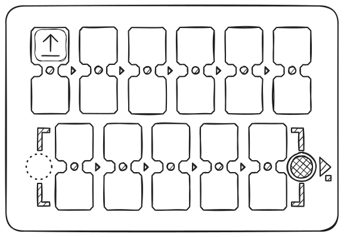

### Instructions Claires

Répétez avec chaque direction (**avancer**, tourner à **gauche**, tourner à **droite**) jusqu'à ce que l'enfant reconnaisse chaque puce.

### La Première Tâche
... Disposez le terrain de jeu ou créez une grille de 10×10 cm à l'aide de ruban adhésif ou d'un marqueur. Placez le robot sur la case de départ. Demandez à l'enfant de composer un programme pour avancer d'une case. Si la mauvaise puce est utilisée, ramenez le robot et invitez l'enfant à réfléchir et à réessayer.

## 2 – Programme et Débogage

### Séquence d'Événements

Placez l'objectif deux cases devant le robot.

Demandez à l'enfant de composer un programme de deux puces pour atteindre l'objectif.

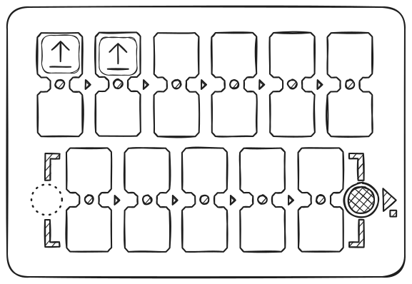

### Séquence de Trois Puces

Cette fois, l'objectif est une case devant et une à droite.

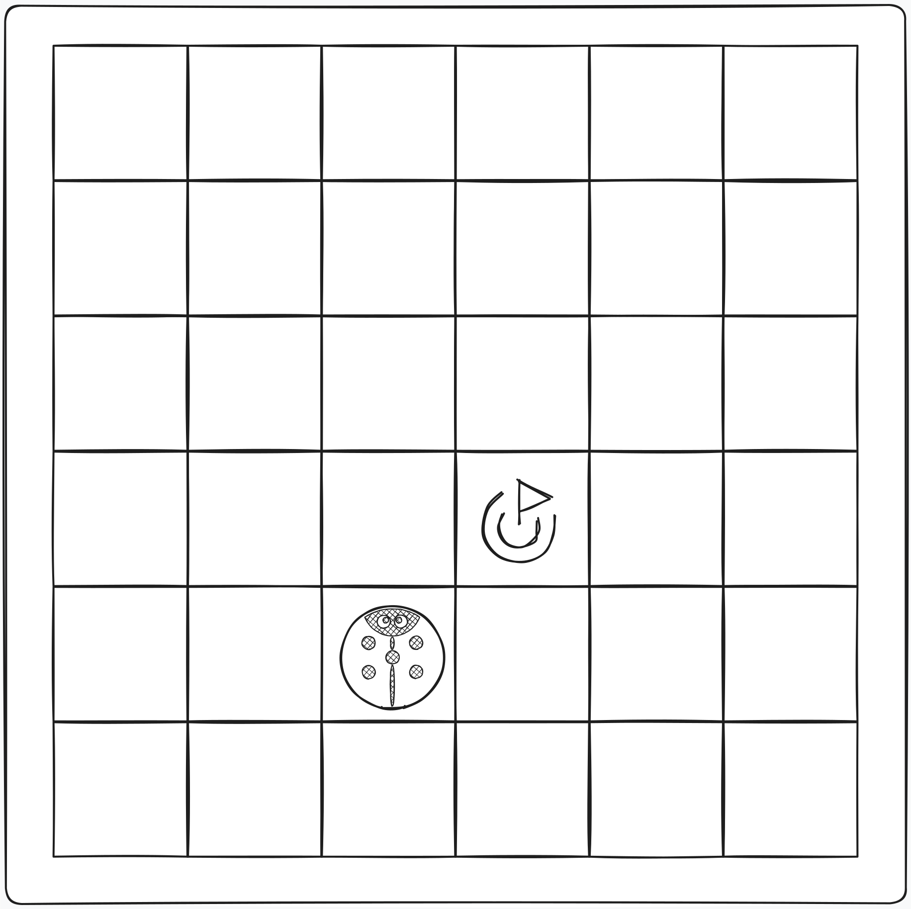

Invitez l'enfant à sélectionner la séquence correcte de commandes.

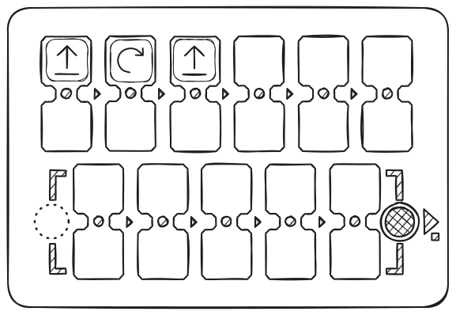

Ne vous inquiétez pas si l'enfant choisit la mauvaise puce. Ramenez simplement le robot à sa position initiale et suggérez de raisonner sur le choix et d'essayer à nouveau.

### Débogage - Trouver l'Erreur
... Définissez une destination une case devant et une case à gauche du robot.

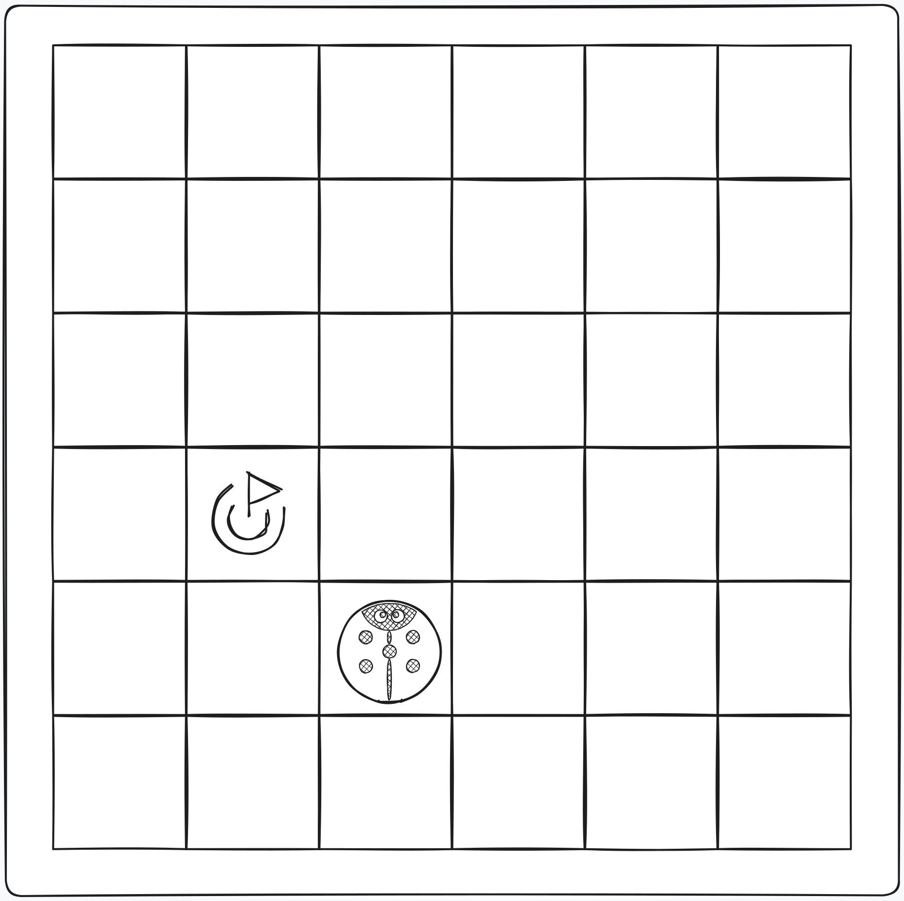

Cette fois, créez un programme en insérant délibérément un mauvais virage dans la séquence.

Demandez à l'enfant de prédire quelle commande dans le programme est incorrecte, et de prédire le résultat erroné, puis permettez-lui d'appuyer sur "**Exécuter**" pour vérifier l'hypothèse.

Après que l'enfant ait réalisé que la séquence était incorrecte - soit par raisonnement, soit par vérification - laissez-le changer la commande erronée pour la bonne, déboguant ainsi le programme.

## 3 – Programme avec Fonction

### La Commande "Fonction"

Une fois les commandes de base maîtrisées, introduisez la puce de commande **Fonction**. C'est un ensemble répétable de commandes qui peut être appelé depuis le programme principal.
... > Vous pouvez utiliser la métaphore d'une tour (d'autres commandes sont empilées sous la puce de fonction) pour expliquer que vous pouvez mettre plus d'instructions à l'intérieur d'une seule puce.

Montrez un exemple : d'abord, placez deux puces "Avancer" dans les emplacements supérieurs et exécutez le programme - le robot se déplace de deux cases.

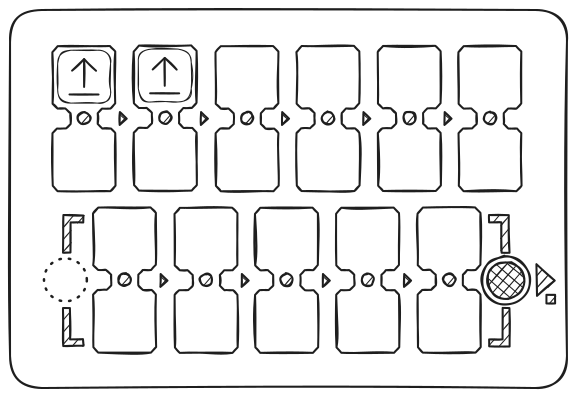

Maintenant, placez les mêmes deux puces "Avancer" dans la fonction (rangée inférieure), et dans le programme principal, utilisez "Fonction". Le résultat est le même, mais maintenant une partie du programme est cachée dans le sous-programme.

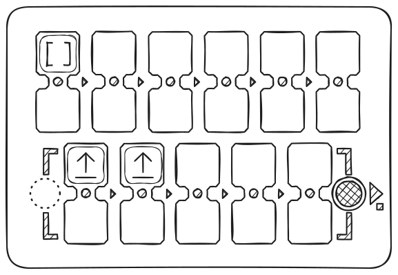

Ensuite, créez la séquence : **Avancer – Avancer – Droite – Avancer – Avancer**.

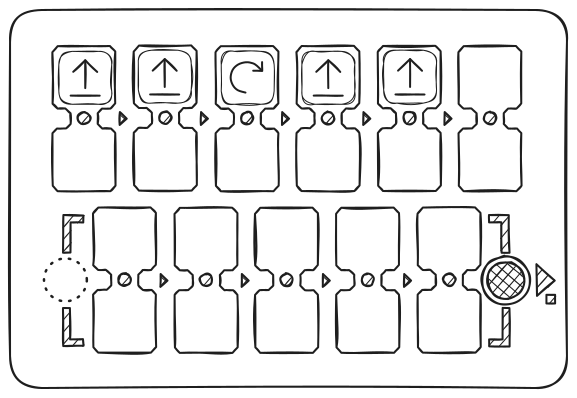

Demandez aux enfants de trouver des sections répétitives et de les "cacher" dans une fonction. La séquence finale : dans la section principale - **Fonction – Droite – Fonction** ; en bas - **Avancer – Avancer**.

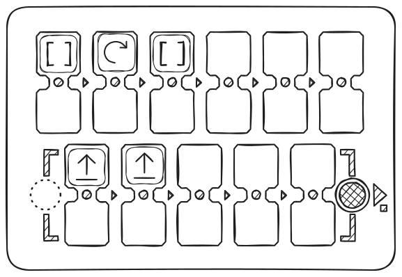

### Résolution de Tâches avec Fonction
... Donnez à l'enfant trois puces "**Avancer**" et deux puces "**Fonction**".

La tâche est d'avancer de cinq cases.

Laissez l'enfant réaliser qu'une fonction doit être utilisée pour des actions répétées afin de résoudre cette tâche.

Si la séquence est incorrecte, ramenez simplement le robot et suggérez de réfléchir à une solution correcte et d'essayer à nouveau.

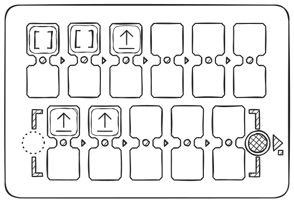

## 4 – Hasard

### La Commande "Direction Aléatoire"

Pour introduire l'idée du hasard, prenez trois puces de direction : "**Avancer**", "**Gauche**" et "**Droite**", mettez-les dans une boîte ou un sac opaque, mélangez-les, et demandez aux enfants d'en tirer une sans regarder et de la montrer au groupe, puis de la remettre. Expliquez le concept du hasard parmi trois résultats avec cet exemple.

Ensuite, montrez la puce de commande "**Direction Aléatoire**" - l'image sur la puce répète les trois puces de direction.
... Expliquez que cette puce fait presque ce qu'ils ont fait précédemment en tirant des puces du sac : elle sélectionne aléatoirement l'une des trois commandes pour le robot puis le déplace d'un pas logique - une case. C'est-à-dire que le robot peut avancer, aller à droite ou à gauche d'une case.

Placez la puce "**Commande Aléatoire**" dans l'emplacement supérieur et exécutez le programme plusieurs fois - le robot se déplacera différemment à chaque fois.

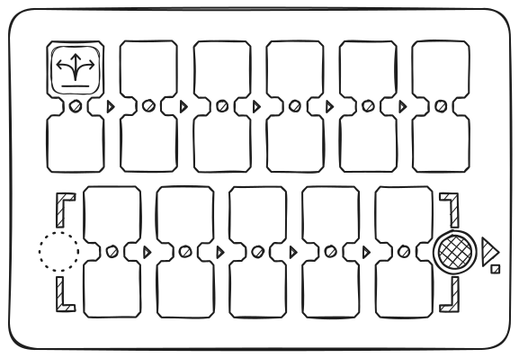

Jouez avec les enfants : laissez-les deviner où le robot ira avant d'exécuter la commande.

Soulignez qu'il s'agit du **hasard** et qu'il n'est pas toujours possible de deviner la direction.

Essayez de faire un petit jeu avec la puce "**Commande Aléatoire**" avec les enfants.

## 5 – Boucles (Répétitions de Commandes)

### Découverte des Boucles Numériques

Montrez aux enfants les puces de valeur, demandez s'ils connaissent les nombres, ont déjà vu des dés pour jeux de société, ou joué à de tels jeux.

... Mettez deux puces "Avancer" dans la rangée supérieure et exécutez - le robot se déplace de deux cases.

Maintenant, laissez un "Avancer", et mettez une puce "répéter 2" en dessous. Le résultat est le même : l'action est répétée deux fois.

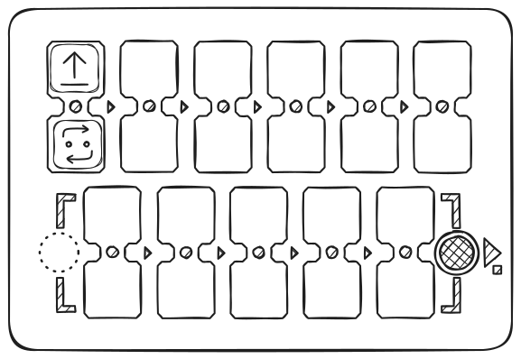

Configurez quatre commandes "**Avancer**" et observez le résultat, puis demandez aux enfants d'utiliser les puces de valeur - **boucles** - pour répéter le mouvement du robot sur quatre cases.

Il existe des solutions simples en utilisant la puce "**Avancer**" et répéter 4, et d'autres, comme "**Avancer**" avec une boucle 3 et une commande "**Avancer**" supplémentaire.

### Appel de Fonction dans une Boucle

Essayez d'utiliser une puce de valeur de boucle avec la commande "Fonction" : par exemple, faites marcher le robot en zigzag en définissant la commande "Fonction" avec une valeur de boucle 5 et une séquence dans la section inférieure du contrôleur de "**Avancer, Droite, Avancer, Gauche**."
... D'abord, créez un programme de fonction pour les "pas" : "avancer", "droite", "avancer", "gauche", et exécutez-le.

Ensuite, ajoutez la boucle avec la valeur 5 à la fonction, de sorte que la fonction se répète plusieurs fois - le robot se déplacera comme un escalier vers la droite et vers le haut.

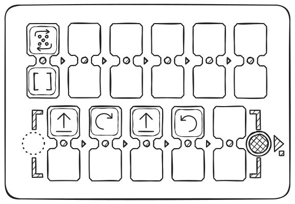

Le robot se déplacera en diagonale comme un escalier, faisant 5 pas.

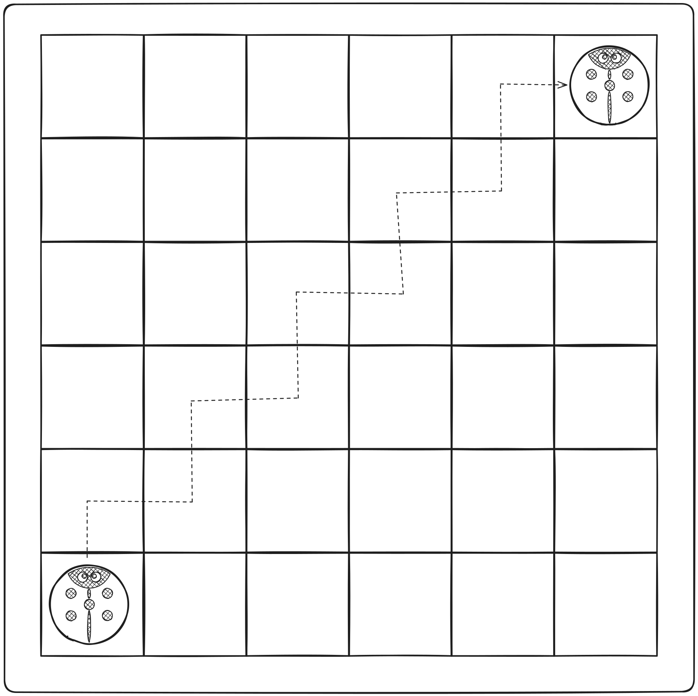

## 6 – Nombres Aléatoires

### Le Concept de Nombre Aléatoire

Parmi les puces se trouve le "Nombre Aléatoire de Répétitions" (montre un dé). Il sélectionne une valeur aléatoire de 1 à 6. Jouez à un jeu impliquant le tirage de puces de répétition d'un sac.

... Pour introduire le concept d'un nombre aléatoire, prenez quatre puces de répétition : "**2**", "**3**", "**4**" et "**5**", placez-les dans une boîte ou un sac opaque, mélangez, et demandez aux enfants d'en tirer une et de nommer la valeur, puis de la remettre. Jouez à un jeu pour voir qui tire le plus grand nombre. Expliquez le caractère aléatoire de quatre états en utilisant cet exemple.

Ensuite, montrez la puce de valeur "**Nombre Aléatoire de Répétitions**". Expliquez que cette puce fait quelque chose de similaire à ce qu'ils ont fait auparavant, en tirant des puces de valeur d'un sac : elle choisit aléatoirement l'un des six nombres (1 à 6), comme un dé, à envoyer au robot pour les répétitions de commandes.

Mettez la puce "**Avancer**" dans l'emplacement supérieur du contrôleur et la puce "**Nombre Aléatoire de Répétitions**" en dessous. Demandez aux enfants d'appuyer sur "**Exécuter**." Ramenez le robot à l'emplacement d'origine. Répétez cette tâche plusieurs fois.

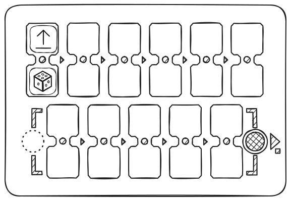

Jouez à un jeu : quel robot va plus loin ?
... Attirez l'attention des enfants sur le fait que le robot se déplace d'un nombre aléatoire de cases : de 1 à 6. Soulignez qu'il s'agit du hasard et qu'on ne peut pas savoir à l'avance jusqu'où ira le robot.

## 7 – Nombres : Distances et Angles

### Découverte des Nombres

Sans définir de valeurs numériques pour les commandes (au-dessus ou en dessous de la commande dans l'emplacement double), le robot utilise des paramètres de mouvement par défaut : sans paramètres, le robot avance de 10 cm et tourne de 90°. Ces valeurs peuvent être modifiées en utilisant des puces numériques.... Exemple : ajoutez la valeur **200** à la commande **"Avancer"** et voyez jusqu'où va le robot. Ajoutez la valeur **180** à la commande **"tourner"** et observez les changements.

> **Important :** Le contrôleur enregistre la dernière valeur définie pour les commandes de mouvement et de rotation.
Si une commande est utilisée sans nouvelle valeur, la dernière valeur enregistrée est appliquée jusqu'à ce que le contrôleur s'éteigne.
La définition d'une nouvelle valeur modifie le paramètre par défaut.... Les valeurs par défaut (100 mm et 90°) peuvent être restaurées en les définissant explicitement ou en redémarrant le contrôleur.

La modification des paramètres permet des trajectoires et des scénarios de mouvement plus complexes. Voir des exemples sur la [page de dessins mathématiques](math_drawings.md).

## 8 – Arithmétique

### Opérations Arithmétiques

Les opérations arithmétiques avec des nombres vous permettent de modifier dynamiquement les valeurs dans un programme pour les commandes de mouvement (Avancer, Reculer, Gauche, Droite), rendant le contrôle du robot plus flexible.

Lorsque vous ajoutez une opération arithmétique, le contrôleur modifie le nombre stocké pour la commande de mouvement et envoie une nouvelle valeur au robot.

Exemple :

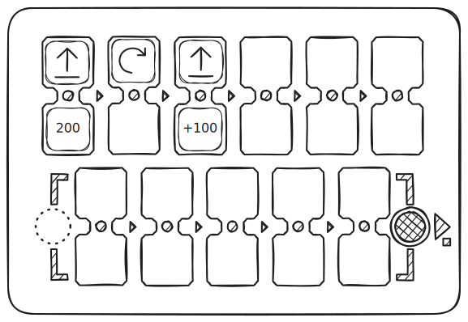

"Avancer 200" - le robot se déplace de 20 cm, "Avancer +100" - 30 cm supplémentaires. Distance totale : 50 cm.

L'utilisation de telles opérations dans une boucle vous permet de créer des progressions.
... > Si, à la suite d'une opération arithmétique, le nombre devient négatif, le robot exécute l'action inverse : au lieu d'avancer, il recule ; au lieu de tourner à gauche, il tourne à droite.

Disponibles : addition (+), soustraction (−), multiplication (*), division (/), racine (√), puissance (^).

Des exemples de motifs sont présentés sur la [page de dessins mathématiques](math_drawings.md).

---

## Jouez et apprenez avec les enfants !

Vous connaissez vos élèves mieux que quiconque. PrimaSTEM est un outil universel pour l'apprentissage ludique. Utilisez-le pour enseigner la programmation, la logique et d'autres matières. Tout dépend de votre imagination !

p/s : Merci d'utiliser PrimaSTEM et pour votre intérêt ! Nous attendons avec impatience vos commentaires : [écrivez-nous](contacts.md) à propos de votre expérience et vos impressions.
