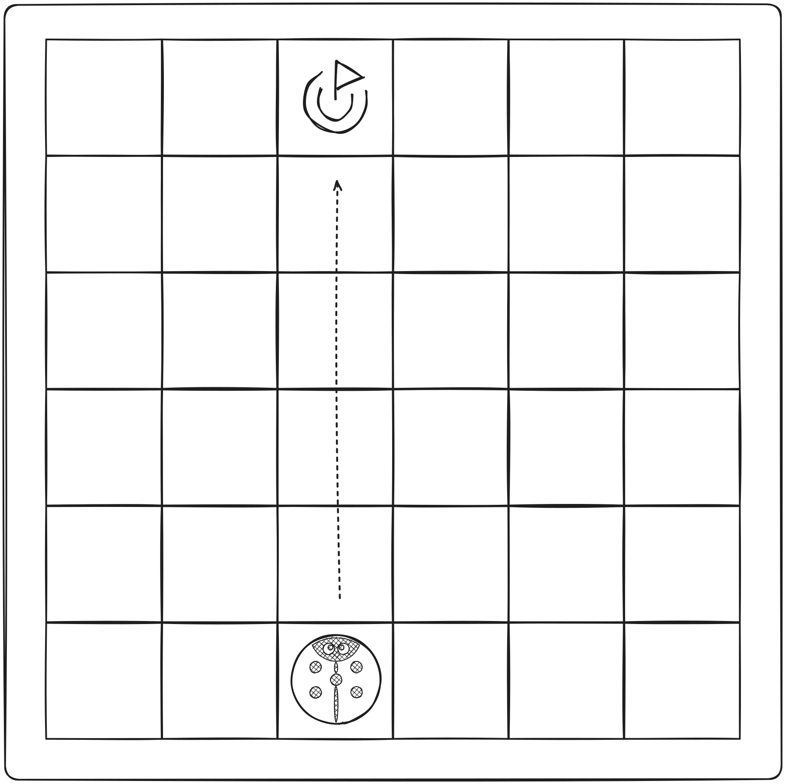
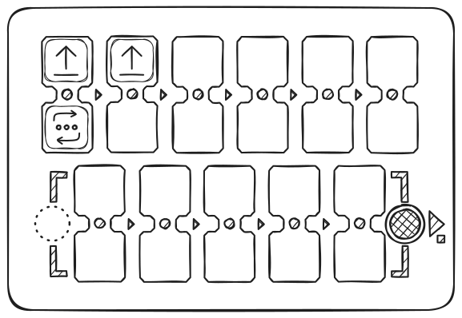

# Guide de l’enseignant

Ce guide décrit les fonctionnalités du kit PrimaSTEM nécessaires à la création de leçons et à son utilisation dans le processus éducatif.

PrimaSTEM est un jeu éducatif pour les enfants de 4 à 12 ans, conçu pour leur apprendre la programmation d’un robot sympathique sans ordinateurs, tablettes ou smartphones. Il développe la logique, les compétences en programmation et les bases des mathématiques.

Les activités avec PrimaSTEM rendent la programmation simple et visuelle. Même pour les plus petits, ce processus devient compréhensible et tactile : les principes de programmation, de logique et de mathématiques sont assimilés sous forme de jeu.

Le jeu avec PrimaSTEM encourage le développement de compétences clés : pensée logique, algorithmique, programmation, mathématiques, géométrie, ainsi que le développement créatif et socio-émotionnel.
Le kit PrimaSTEM constitue une étape préparatoire idéale pour se familiariser avec les langages de programmation par blocs, tels que [Scratch](https://en.wikipedia.org/wiki/Scratch_(programming_language)) ou [LOGO](https://en.wikipedia.org/wiki/Logo_(programming_language)).

## Présentation du kit éducatif

### Où utiliser PrimaSTEM ?

Il est adapté aux programmes éducatifs suivants :

- Centres d’éducation préscolaire
- Écoles maternelles utilisant la méthode Montessori
- Écoles élémentaires
- Enseignement à domicile
- Centres de développement spécialisés
- Groupes périscolaires
- Clubs d’initiation à la programmation
- Camps éducatifs pour enfants

### Que faut-il savoir pour commencer ?

Avant de l’utiliser, il est recommandé aux enseignants et parents de se familiariser avec le [manuel d’utilisation](user_manual.md) ainsi que ce guide. Aucune compétence préalable en programmation n’est requise – les supports fournissent toutes les bases nécessaires pour débuter.

## Recherches et valeur pédagogique

PrimaSTEM s’inspire du langage de programmation [LOGO](https://en.wikipedia.org/wiki/Logo_(programming_language)) créé par [Seymour Papert](https://en.wikipedia.org/wiki/Seymour_Papert) et de la pédagogie Montessori. LOGO et le robot-tortue ont rendu la programmation accessible et intuitive pour les enfants.

Les blocs de commande PrimaSTEM concrétisent cette approche. L’apprentissage devient intuitif grâce à un contrôle tactile, sans écran ni texte.

En observant le robot, les enfants comprennent chaque commande et assimilent les algorithmes par la pratique.

Le robot dispose d’une orientation, ce qui permet à l’enfant de s’identifier à lui et de mieux comprendre la logique fondamentale des programmes.

Toutes les commandes sont simples et précises : elles indiquent exactement dans quelle direction le robot doit se déplacer. Apprendre à faire « agir » ou « penser » le robot aide l’enfant à réfléchir à ses propres actions et raisonnements, rendant le processus d’apprentissage plus efficace.

Les blocs PrimaSTEM offrent une représentation visuelle simplifiée des langages de programmation. Au début de l’apprentissage, aucun texte ni chiffre, mais seulement des commandes de base.

### Pourquoi le bois ?

La télécommande et le robot sont en bois. En pratique, les enfants apprécient davantage jouer avec des jouets en bois : ils sont sûrs, durables et chaque enfant s’approprie son histoire d’utilisation.

## Concepts de programmation avec PrimaSTEM

Les blocs physiques PrimaSTEM sont analogues aux instructions des langages de programmation, et illustrent les notions fondamentales.

### Algorithmes

**Algorithme** : séquence précise de commandes (blocs) qui constitue un programme.

### File d'attente

Les commandes sur la télécommande PrimaSTEM sont exécutées strictement de gauche à droite, illustrant clairement la notion de file d’attente d’exécution.

### Correction d’erreurs (Débogage)

Corriger une erreur est simple : il suffit de remplacer le bloc. Cela développe l’autonomie dans la correction des programmes.

### Fonction

Une fonction (sous-programme) est un ensemble de commandes dans la partie inférieure de la télécommande, appelée depuis le programme principal à l’aide du bloc « **Fonction** ».

## Application sur d’autres matières

PrimaSTEM favorise également l’apprentissage d’autres compétences :

- **Communication** : Le jeu en groupe encourage la coopération.
- **Motricité** : Manipuler les blocs améliore la coordination.
- **Compétences sociales** : Les enfants gagnent en confiance et apprennent à résoudre des problèmes ensemble.
- **Mathématiques** : Assimilation des notions de base.
- **Logique** : Apprentissage des séquences et de l’anticipation des résultats.

> En assemblant une chaîne de blocs, l’enfant découvre la programmation de manière tactile, visuelle et intellectuelle. Après avoir appuyé sur « Exécuter », le robot se déplace et l’enfant compare le résultat à ses attentes, renforçant ainsi l’apprentissage.

## Découverte du robot et de la télécommande

### Le robot

Présentez le robot comme un compagnon à programmer. Expliquez qu'il n’a pas de volonté propre et ne suit que les consignes données – comme un appareil électroménager que l’on doit allumer.

### La télécommande

Expliquez que la télécommande transmet les commandes au robot. Montrez comment insérer les blocs et programmer le robot.

> Le programme principal est construit sur la rangée supérieure de la télécommande (6 cases). La rangée inférieure (5 cases) est destinée à la sous-programme/fonction, accessible via le bloc « **Fonction** ».

### Blocs de commande

Les blocs représentent les instructions pour le robot, insérées dans la télécommande. Après avoir appuyé sur « Exécuter », le robot exécute la séquence. Chaque bloc est une commande, initiant l’enfant à la pensée informatique et à la conception de programmes. Il est essentiel que l’enfant comprenne l’effet de chaque commande sur le robot. Expliquez que les blocs sont indispensables : sans eux, le robot ne fonctionnera pas.

## 1 - Premier programme

### Cause à effet

L’objectif principal est d’illustrer la relation entre commande et résultat. Faites insérer le bloc « Avancer » dans la première case et appuyez sur « Exécuter ». L’enfant observe la correspondance entre la commande et l’action.

### Instructions explicites

Répétez l’exercice avec chaque direction (**avancer**, tourner à **gauche**, tourner à **droite**) jusqu’à ce que l’enfant identifie chaque bloc.

### Première tâche

Installez un tapis de jeu ou tracez une grille de 10×10 cm avec du ruban ou un marqueur. Placez le robot sur la case de départ. Demandez à l’enfant de créer un programme pour avancer d’une case. Si le mauvais bloc est utilisé, replacez le robot et encouragez-le à trouver une nouvelle solution.

## 2 - Programme et débogage

### Suite d’événements

Placez la cible deux cases devant le robot.

L’enfant doit écrire un programme de deux blocs pour atteindre la cible.

### Séquence de trois blocs

Nouvelle cible : une case devant et une à droite.

L’enfant élabore la séquence correcte de commandes.

S’il se trompe, replacez le robot et incitez-le à réfléchir au bon choix.

### Débogage – identifier l’erreur

Placez la cible une case devant et une à gauche du robot.

Créez intentionnellement une erreur dans la séquence et demandez à l’enfant de la prédire, puis de tester le résultat avec « **Exécuter** ».

Une fois constatée l’erreur, laissez-le la corriger et affiner son programme, favorisant ainsi l’auto-correction.  

## 3 - Programme avec Fonction

### Commande « Fonction »

Lorsque les commandes de base sont acquises, présentez le bloc « **Fonction** ». Celui-ci appelle une séquence répétitive de commandes stockées dans la rangée inférieure.

> Pour l’expliquer, comparez cette notion à une « tour » de blocs – la fonction regroupe plusieurs instructions dans un bloc unique.

Montrez l’exemple : insérez deux blocs « Avancer » dans la rangée supérieure et exécutez – le robot avance de deux cases.

Ensuite, placez ces deux blocs dans la fonction (rangée inférieure) et utilisez « Fonction » dans le programme principal. Le résultat est identique, mais la séquence est désormais encapsulée.

Créez ensuite la séquence : **Avancer – Avancer – Droite – Avancer – Avancer**.

Demandez aux enfants de repérer la répétition et de la « cacher » dans la fonction. Résultat final : dans le programme principal – **Fonction – Droite – Fonction**, dans la fonction – **Avancer – Avancer**.

### Résolution d’exercices avec fonction

Donnez à l’enfant 3 blocs « **Avancer** » et 2 « **Fonction** ».

But : avancer de 5 cases.

L’enfant doit utiliser la fonction pour répéter l’action plusieurs fois.

En cas d’erreur, replacez le robot et laissez-le réfléchir à d’autres options.

## 4 - Aléatoire

### Commande « Déplacement aléatoire »

Pour introduire la notion d’aléa, placez 3 blocs de direction (« **Avancer** », « **Gauche** », « **Droite** ») dans une boîte opaque. Laissez les enfants tirer au hasard et les montrer au groupe, puis remettez-les en place. Expliquez la notion d’aléa à partir de cet exercice.

Présentez le bloc « **Déplacement aléatoire** », dont le pictogramme reprend les trois directions.

Expliquez que ce bloc permet, comme l’exercice précédent, de choisir au hasard une des trois commandes et de déplacer le robot d’une case.

Placez « **Déplacement aléatoire** » en première case et lancez plusieurs fois le programme – les déplacements seront différents à chaque essai.

Laissez les enfants deviner la direction prise par le robot avant chaque exécution.

Soulignez que c’est le hasard : il est impossible de le deviner à coup sûr.

Organisez un petit jeu basé sur cette fonctionnalité.

## 5 - Boucles (répétitions)

### Introduction aux boucles numériques

Montrez les blocs de valeurs, demandez si les enfants connaissent les chiffres ou les dés de jeux de société.

Insérez deux blocs « Avancer » en haut et exécutez – le robot avance de deux cases.

Puis ne gardez qu’un bloc « Avancer » et placez dessous le bloc « boucle 2 ». Même résultat : l’action se répète deux fois.

Placez 4 blocs « **Avancer** », observez le résultat, puis demandez aux enfants d’obtenir le même effet en utilisant les blocs « boucle ».

Plusieurs solutions sont possibles : par exemple un bloc « **Avancer** » avec boucle 4, ou un bloc « Avancer » avec boucle 3 et un autre « Avancer ».

### Boucle appelant une fonction

Essayez d’appliquer une boucle à la commande « Fonction », par exemple pour faire un zigzag : placez « Fonction » avec boucle 5, et dans la fonction (rangée inférieure), une séquence « **Avancer** », « **Droite** », « **Avancer** », « **Gauche** ».

Commencez par créer la fonction « escalier » : « avancer », « droite », « avancer », « gauche », puis exécutez.

Ajoutez la boucle 5 sur « Fonction » : le robot montera 5 marches d’escalier à droite.

Le robot se déplace en diagonale, effectuant 5 marches.

## 6 - Nombres aléatoires

### Introduction aux nombres aléatoires

Parmi les blocs figure le « Nombre de répétitions aléatoire » (illustré par un dé). Il choisit un nombre entre 1 et 6. Organisez un jeu où les enfants tirent au hasard les blocs « boucle » d’une boîte.

Pour explorer la notion d’aléa, placez 4 blocs « boucle » : « **2** », « **3** », « **4** » et « **5** », dans une boîte opaque. Les enfants piochent à tour de rôle, nomment les valeurs, puis les remettent. Faites un jeu pour tirer la valeur la plus élevée. Expliquez le principe du hasard ainsi.

Présentez ensuite le bloc « **Nombre de répétitions aléatoire** ». Expliquez que ce bloc choisit au hasard un nombre de 1 à 6 comme un dé, puis transmet la valeur au robot qui répète l’action.

Placez « **Avancer** » suivi de « **Nombre de répétitions aléatoire** » sur la télécommande. Appuyez sur « **Exécuter** ». Replacez le robot au départ, répétez l’exercice.

Faites un jeu : qui fera avancer son robot le plus loin.

Mettez en évidence que le robot se déplace d’un nombre aléatoire de cases (1 à 6). Soulignez que l’on ne peut pas prévoir la distance exacte à l’avance.

## 7 - Nombres : distances et angles

### Utilisation des valeurs numériques

Sans bloc de valeur, le robot utilise les paramètres par défaut : « Avancer » = 10 cm, « Tourner » = 90°. Ces valeurs peuvent être modifiées à l’aide des blocs numériques. Par exemple, ajoutez le bloc **200** à « Avancer » pour modifier la distance, ou **180** à « Tourner » pour changer l’angle.

> **Important :** La télécommande mémorise la dernière valeur utilisée pour chaque commande jusqu’à extinction.
Si une commande est utilisée sans nouvelle valeur, la dernière valeur reste en vigueur jusqu’à l’arrêt.
Une nouvelle valeur modifie le paramètre par défaut.
Les valeurs par défaut (100 mm et 90°) peuvent être restaurées en les indiquant explicitement ou en redémarrant la télécommande.

Modifier ces paramètres permet de créer des trajectoires complexes. Voir des exemples sur la [page des dessins mathématiques](math_drawings.md).

## 8 - Arithmétique

### Opérations arithmétiques

Les opérations arithmétiques permettent de modifier dynamiquement les valeurs associées aux commandes de mouvement (Avancer, Reculer, Tourner Gauche/Droite), rendant la programmation plus flexible.

Si vous ajoutez une opération arithmétique, la télécommande ajuste la valeur mémorisée pour la commande concernée et envoie la nouvelle valeur au robot.

Exemple :

« Avancer 200 » – le robot parcourt 20 cm, « Avancer +100 » – 30 cm supplémentaires. Distance totale : 50 cm.

Utilisées en boucle, ces opérations permettent de construire des progressions.

> Si le résultat devient négatif, le robot effectue l’action inverse : recule au lieu d’avancer, tourne à droite au lieu de gauche, etc.

Opérations disponibles : addition (+), soustraction (−), multiplication (*), division (/), racine (√), puissance (^).

Exemples de motifs sur la [page dédiée](math_drawings).

---

## Jouez et apprenez avec vos élèves !

Vous connaissez mieux que quiconque vos élèves. PrimaSTEM est un outil universel pour l’apprentissage ludique. Utilisez-le pour enseigner la programmation, la logique et d’autres matières. Laissez place à votre imagination !

*p/s : Merci d’utiliser PrimaSTEM et pour votre intérêt ! Faites-nous part de vos retours : [écrivez-nous](contacts.md) pour partager votre expérience.*
