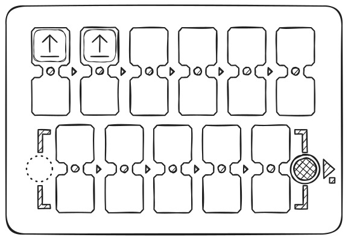

# Guide de l'Enseignant

Ce guide décrit les fonctionnalités du kit PrimaSTEM nécessaires pour créer des leçons et l'intégrer dans le processus éducatif.

PrimaSTEM est un jouet éducatif pour les enfants de 4 à 12 ans qui les aide à apprendre à programmer un robot amical sans ordinateurs, tablettes ou téléphones. Il développe la logique, les compétences en programmation et les mathématiques.

Les leçons avec PrimaSTEM rendent la programmation simple et visuelle pour les enfants. Même les très jeunes apprenants trouvent le processus clair et tactile - les bases de la programmation, de la logique et des mathématiques sont apprises sous forme ludique.

Jouer avec PrimaSTEM favorise le développement de compétences clés : la pensée logique, les algorithmes, la programmation, les mathématiques, la géométrie, ainsi que le développement créatif et socio-émotionnel. Le kit PrimaSTEM est une étape préparatoire à la familiarisation avec les langages de programmation par blocs comme [Scratch](https://en.wikipedia.org/wiki/Scratch_(programming_language)) ou [LOGO](https://en.wikipedia.org/wiki/Logo_(programming_language)).

## Se Familiariser avec le Kit Éducatif

### Où PrimaSTEM Peut-il Être Utilisé?

Applications efficaces dans les programmes éducatifs suivants:

- Centres d'éducation de la petite enfance
- Jardins d'enfants Montessori
- Écoles primaires
- Enseignement à domicile
- Centres de développement spécialisés
- Groupes parascolaires
- Clubs d'initiation à la programmation
- Camps éducatifs pour enfants

### Que Devez-vous Savoir pour Commencer?

Avant d'utiliser le kit, nous recommandons aux enseignants et aux parents de lire le [manuel d'utilisation](user_manual.md) et ce guide. Aucune compétence particulière en programmation n'est requise - les documents fournissent les bases nécessaires à l'enseignement.

## Recherche et Valeur du Kit

PrimaSTEM s'inspire du langage de programmation [LOGO](https://en.wikipedia.org/wiki/Logo_(programming_language)), créé par [Seymour Papert](https://en.wikipedia.org/wiki/Seymour_Papert), et de la pédagogie Montessori. LOGO et le robot tortue ont rendu la programmation visuelle et accessible aux enfants.

Les jetons de commande PrimaSTEM mettent en œuvre cette approche. L'apprentissage devient intuitif grâce à un contrôle tactile simple, ne nécessitant ni écrans ni texte.

En observant le robot, les enfants apprennent la signification de chaque commande en pratiquant des algorithmes en temps réel.

Le robot possède une caractéristique importante : il a une direction, ce qui permet à l'enfant de s'identifier à lui et de comprendre plus facilement la logique fondamentale du fonctionnement des programmes.

Toutes les commandes sont simples et claires : elles indiquent exactement dans quelle direction le robot doit se déplacer. Apprendre au robot à "agir" ou à "penser" encourage les enfants à réfléchir à leurs propres actions et pensées, rendant le processus d'apprentissage de la programmation plus efficace.

Les jetons PrimaSTEM sont une représentation visuelle et simplifiée des langages de programmation. Au début de l'apprentissage, il n'y a ni texte ni chiffres - uniquement des commandes de base.

### Pourquoi le Bois?

Le contrôleur et le robot sont fabriqués en bois. La pratique a montré que les enfants préfèrent jouer avec des jouets en bois - ils sont sûrs, durables et créent un sentiment d'histoire personnelle lors de leur utilisation.

## Concepts de Programmation avec PrimaSTEM

Les jetons physiques PrimaSTEM sont analogues aux instructions dans les langages de programmation réels, démontrant des concepts importants.

### Algorithmes

Les **algorithmes** sont des séquences de commandes précises (jetons) qui constituent un programme.

### File d'Attente

Les commandes sur le contrôleur PrimaSTEM sont exécutées strictement de gauche à droite, démontrant visuellement l'ordre d'exécution.

### Débogage (Correction d'Erreurs)

Les erreurs sont faciles à corriger : il suffit de remplacer un jeton. Cette approche développe des compétences de débogage indépendantes.

### Fonction

Une fonction (sous-programme) est un ensemble de commandes dans la partie inférieure du contrôleur, appelé depuis le programme principal à l'aide du jeton "**Fonction**".

## Application dans d'Autres Matières

PrimaSTEM aide également à développer d'autres compétences:

- **Communication** : Le jeu en groupe favorise la collaboration.
- **Habiletés motrices** : Travailler avec les jetons améliore la coordination.
- **Compétences sociales** : Les enfants gagnent en confiance et apprennent le travail d'équipe.
- **Mathématiques** : Les concepts mathématiques de base sont maîtrisés.
- **Logique** : Les enfants apprennent à construire des séquences et à prévoir les résultats.

> En arrangeant les jetons, l'enfant explore la programmation de manière tactile, visuelle et intellectuelle. Après avoir appuyé sur le bouton "Exécuter", le robot se déplace, et le résultat est comparé à l'attente de l'enfant. Cette expérience complète accélère l'apprentissage.

## Faire Connaissance avec le Robot et le Contrôleur

### Robot

Dites aux enfants que le robot est leur ami, qu'ils peuvent programmer. Expliquez : il n'a pas de pensées propres et n'exécute que leurs instructions - comme les appareils ménagers qui nécessitent d'être allumés.

### Contrôleur

Expliquez que le contrôleur envoie des commandes au robot. Montrez comment insérer des jetons de commande et programmer le robot.

> Le programme principal est construit dans la rangée supérieure du contrôleur (6 emplacements). La rangée inférieure (5 emplacements) est destinée au sous-programme/fonction et utilisée avec la commande "**Fonction**".

### Jetons de Commande

Les jetons sont des commandes pour le robot qui sont insérées dans le contrôleur. Après avoir appuyé sur "Exécuter", le robot effectue la séquence. Chaque jeton est une commande distincte, qui enseigne la pensée informatique et la conception de programmes. Il est important que les enfants comprennent ce que fait le robot lorsque chaque commande est activée - cela leur apprend à planifier des programmes et à prévoir les actions du robot. Dites aux enfants : les jetons ne doivent pas être perdus ou endommagés - sans eux, le robot ne peut pas bouger.

## 1 – Le Premier Programme

### Cause et Effet

L'objectif principal est de montrer aux enfants le lien entre une commande et une action. Laissez l'enfant insérer un jeton "En avant" dans le premier emplacement du contrôleur et appuyer sur "Exécuter". L'enfant doit observer la correspondance entre le jeton et l'action.

### Instructions Claires

Répétez avec chaque direction (**en avant**, tourner à **gauche**, tourner à **droite**) jusqu'à ce que l'enfant reconnaisse chaque jeton.

### La Première Tâche

Disposez le terrain de jeu ou créez une grille de 10×10 cm à l'aide de ruban adhésif ou d'un marqueur. Placez le robot sur la case de départ. Demandez à l'enfant de composer un programme pour avancer d'une cellule. Si le mauvais jeton est utilisé, ramenez le robot et invitez l'enfant à réfléchir et à réessayer.

## 2 – Programme et Débogage

### Séquence d'Événements

Fixez l'objectif à deux cellules devant le robot.

Demandez à l'enfant de composer un programme de deux jetons pour atteindre l'objectif.

### Séquence de Trois Jetons

Cette fois, l'objectif est une cellule en avant et une à droite.

Invitez l'enfant à sélectionner la bonne séquence de commandes.

Ne vous inquiétez pas si l'enfant choisit le mauvais jeton. Il suffit de ramener le robot à sa position initiale et de suggérer de réfléchir au choix et de réessayer.

### Débogage - Trouver l'Erreur

Fixez une destination à une case devant et une case à gauche du robot.

Cette fois, créez un programme en insérant délibérément un mauvais virage dans la séquence.

Demandez à l'enfant de prédire quelle commande dans le programme est incorrecte et de prévoir le résultat erroné, puis permettez-lui d'appuyer sur "**Exécuter**" pour vérifier l'hypothèse.

Après que l'enfant se soit rendu compte que la séquence était incorrecte - soit par raisonnement, soit par vérification - laissez-le changer la commande erronée en commande correcte, débogant ainsi le programme.

## 3 – Programme avec Fonction

### La Commande "Fonction"

Une fois les commandes de base maîtrisées, présentez le jeton de commande **Fonction**. C'est un ensemble répétable de commandes qui peut être appelé depuis le programme principal.

> Vous pouvez utiliser la métaphore d'une tour (d'autres commandes sont empilées sous le jeton de fonction) pour expliquer que vous pouvez mettre plus d'instructions à l'intérieur d'un seul jeton.

Montrez un exemple : d'abord, placez deux jetons "En avant" dans les emplacements supérieurs et exécutez le programme - le robot se déplace de deux cellules.

Maintenant, placez les mêmes deux jetons "En avant" dans la fonction (rangée inférieure), et dans le programme principal, utilisez "Fonction". Le résultat est le même, mais maintenant une partie du programme est cachée dans le sous-programme.

Ensuite, créez la séquence : **En avant – En avant – Droite – En avant – En avant**.

Demandez aux enfants de trouver les sections répétitives et de les "cacher" dans une fonction. La séquence finale : dans la section principale - **Fonction – Droite – Fonction** ; en bas - **En avant – En avant**.

### Résolution de Tâches avec Fonction

Donnez à l'enfant trois jetons "**En avant**" et deux jetons "**Fonction**".

La tâche consiste à avancer de cinq cases.

Laissez l'enfant réaliser qu'une fonction doit être utilisée pour les actions répétées afin de résoudre cette tâche.

Si la séquence est erronée, il suffit de ramener le robot et de suggérer de réfléchir à une solution correcte et d'essayer à nouveau.

## 4 – Aléatoire

### La Commande "Direction Aléatoire"

Pour introduire l'idée d'aléatoire, prenez trois jetons de direction : "**En avant**", "**Gauche**" et "**Droite**", mettez-les dans une boîte opaque ou un sac, mélangez-les et demandez aux enfants d'en tirer un sans regarder et de le montrer au groupe, puis de le remettre. Expliquez le concept d'aléatoire parmi trois résultats avec cet exemple.

Ensuite, montrez le jeton de commande "**Direction Aléatoire**" - l'image sur le jeton reprend les trois jetons de direction.

Expliquez que ce jeton fait presque ce qu'ils ont fait précédemment en tirant des jetons du sac : il sélectionne aléatoirement l'une des trois commandes pour le robot, puis le déplace d'un pas logique - une cellule. C'est-à-dire que le robot peut avancer, tourner à droite ou à gauche d'une cellule.

Placez le jeton "**Commande Aléatoire**" dans l'emplacement supérieur et exécutez le programme plusieurs fois - le robot se déplacera différemment à chaque fois.

Jouez avec les enfants : laissez-les deviner où ira le robot avant d'exécuter la commande.

Soulignez qu'il s'agit d'**aléatoire** et qu'il n'est pas toujours possible de deviner la direction.

Essayez de créer un petit jeu avec le jeton "**Commande Aléatoire**" avec les enfants.

## 5 – Boucles (Répétitions de Commandes)

### Découvrir les Boucles Numériques

Montrez aux enfants les jetons de valeur, demandez-leur s'ils connaissent les nombres, s'ils ont déjà vu des dés pour jeux de société ou s'ils ont joué à de tels jeux.

Placez deux jetons "En avant" dans la rangée supérieure et exécutez - le robot se déplace de deux cellules.

Maintenant, laissez un seul "En avant" et placez un jeton "répéter 2" en dessous. Le résultat est le même : l'action est répétée deux fois.

Configurez quatre commandes "**En avant**" et observez le résultat, puis demandez aux enfants d'utiliser les jetons de valeur - **boucles** - pour répéter le déplacement du robot sur quatre cellules.

Il existe des solutions simples en utilisant le jeton "**En avant**" et répéter 4, et d'autres, comme "**En avant**" avec boucle 3 et une commande "**En avant**" supplémentaire.

### Appel de Fonction dans une Boucle

Essayez d'utiliser un jeton de valeur de boucle avec la commande "Fonction" : par exemple, faites marcher le robot en zigzag en réglant la commande "Fonction" avec valeur de boucle 5 et une séquence dans la section inférieure du contrôleur de "**En avant, Droite, En avant, Gauche**".

D'abord, créez un programme de fonction pour les "pas" : "en avant", "droite", "en avant", "gauche", et exécutez-le.

Ensuite, ajoutez la boucle avec la valeur 5 à la fonction, afin que la fonction se répète plusieurs fois - le robot se déplacera comme un escalier vers la droite et vers le haut.

Le robot se déplacera en diagonale comme un escalier, faisant 5 pas.

## 6 – Nombres Aléatoires

### Le Concept de Nombre Aléatoire

Parmi les jetons se trouve le "Nombre Aléatoire de Répétitions" (montre un dé). Il sélectionne une valeur aléatoire de 1 à 6. Jouez à un jeu impliquant de tirer des jetons de répétition d'un sac.

Pour introduire le concept de nombre aléatoire, prenez quatre jetons de répétition : "**2**", "**3**", "**4**" et "**5**", placez-les dans une boîte opaque ou un sac, mélangez et demandez aux enfants d'en tirer un et d'en nommer la valeur, puis de le remettre. Jouez à un jeu pour voir qui tire le plus grand nombre. Expliquez l'aléatoire de quatre états en utilisant cet exemple.

Ensuite, montrez le jeton de valeur "**Nombre Aléatoire de Répétitions**". Expliquez que ce jeton fait quelque chose de similaire à ce qu'ils ont fait auparavant, en tirant des jetons de valeur d'un sac : il choisit aléatoirement l'un des six nombres (1 à 6), comme un dé, pour l'envoyer au robot pour les répétitions de commandes.

Mettez le jeton "**En avant**" dans l'emplacement supérieur du contrôleur et le jeton "**Nombre Aléatoire de Répétitions**" en dessous. Demandez aux enfants d'appuyer sur "**Exécuter**". Ramenez le robot à l'emplacement d'origine. Répétez cette tâche plusieurs fois.

Jouez à un jeu : quel robot va plus loin ?

Attirez l'attention des enfants sur le fait que le robot se déplace d'un nombre aléatoire de cellules : de 1 à 6. Soulignez qu'il s'agit d'aléatoire et que vous ne pouvez pas savoir à l'avance jusqu'où ira le robot.

## 7 – Nombres : Distances et Angles

### Découvrir les Nombres

Sans définir de valeurs numériques pour les commandes (au-dessus ou en dessous de la commande dans le double emplacement), le robot utilise des paramètres de mouvement par défaut : sans paramètres, le robot avance de 10 cm et tourne de 90°. Ces valeurs peuvent être modifiées en utilisant des jetons numériques.

Exemple : ajoutez la valeur **200** à la commande **"En avant"** et voyez jusqu'où va le robot. Ajoutez la valeur **180** à la commande **"tourner"** et observez les changements.

> **Important :** Le contrôleur enregistre la dernière valeur définie pour les commandes de mouvement et de rotation. Si une commande est utilisée sans nouvelle valeur, la dernière valeur enregistrée est appliquée jusqu'à ce que le contrôleur s'éteigne. Définir une nouvelle valeur modifie le paramètre par défaut. Les valeurs par défaut (100 mm et 90°) peuvent être restaurées en les définissant explicitement ou en redémarrant le contrôleur.

La modification des paramètres permet des trajectoires et des scénarios de mouvement plus complexes. Voir des exemples sur la [page des dessins mathématiques](math_drawings.md).

## 8 – Arithmétique

### Opérations Arithmétiques

Les opérations arithmétiques avec des nombres vous permettent de modifier dynamiquement les valeurs dans un programme pour les commandes de mouvement (En avant, En arrière, Gauche, Droite), rendant le contrôle du robot plus flexible.

Lorsque vous ajoutez une opération arithmétique, le contrôleur modifie le nombre stocké pour la commande de mouvement et envoie une nouvelle valeur au robot.

Exemple :

"En avant 200" - le robot se déplace de 20 cm, "En avant +100" - 30 cm de plus. Distance totale : 50 cm.

L'utilisation de telles opérations dans une boucle vous permet de créer des progressions.

> Si, à la suite d'une opération arithmétique, le nombre devient négatif, le robot exécute l'action inverse : au lieu d'avancer, il recule ; au lieu de tourner à gauche, il tourne à droite.

Disponibles : addition (+), soustraction (−), multiplication (*), division (/), racine (√), puissance (^).

Des exemples de motifs sont présentés sur la [page des dessins mathématiques](math_drawings.md).

---

## Jouez et apprenez avec les enfants !

Vous connaissez vos élèves mieux que quiconque. PrimaSTEM est un outil universel pour l'apprentissage ludique. Utilisez-le pour enseigner la programmation, la logique et d'autres matières. Tout dépend de votre imagination !

p/s: Merci d'utiliser PrimaSTEM et pour votre intérêt ! Nous attendons vos commentaires avec impatience : [écrivez-nous](contacts.md) au sujet de votre expérience et de vos impressions.
